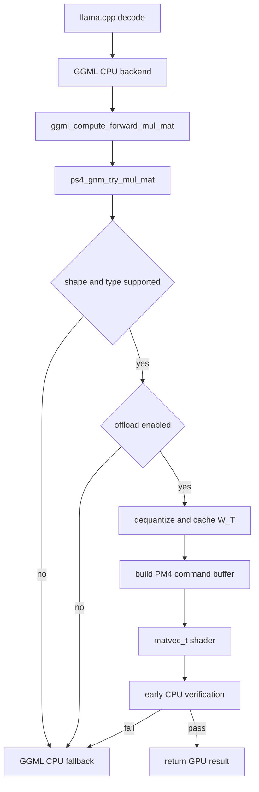
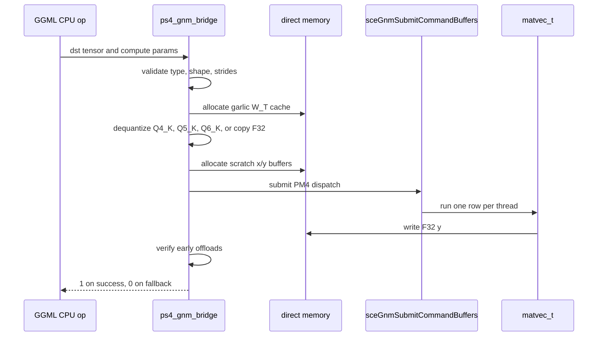

# GPU Bridge

Aether has an experimental GGML bridge that can route selected `MUL_MAT` operations through the PS4 GNM compute path. It is intentionally opt-in: the bridge initializes and logs candidates, but real offload stays disabled until `/gpu/offload` enables it.



## Hook Point

The hook lives in `external/llama.cpp/ggml/src/ggml-cpu/ggml-cpu.c`.

`ggml_compute_forward_mul_mat` calls:

```c
if (!params->use_ref && ps4_gnm_try_mul_mat(params, dst)) {
    return;
}
```

If the bridge returns `0`, GGML continues through the normal CPU path.

## Bridge Files

- `source/ps4_gnm_bridge.cpp`: bridge implementation.
- `include/ps4_gnm_bridge.h`: C ABI exported to GGML C code.
- `include/gnm_shaders.h`: compiled shader bytes.
- `shaders/matvec_t.s`: transposed-weight matvec shader source.
- `Media/jb.prx`: jailbreak helper loaded before runtime GNM symbol lookup.

## Data Path



## Supported Work

The current gate accepts:

- destination type `F32`
- activation type `F32`
- weight types `F32`, `Q4_K`, `Q5_K`, `Q6_K`
- selected large matvec shapes proven or being investigated on PS4
- row count divisible by 64
- `K` divisible by `QK_K` for K-quants

The bridge records candidates even when offload is disabled. Use this to collect safe runtime shape data before enabling offload.

## Memory Model

The bridge uses PS4 direct memory:

- onion write-back memory for control and command buffers
- garlic write-combined memory for shader data and cached transposed weights
- a cache ceiling of 1536 MiB

Large GGUF models also consume direct memory through mmap. That means a model can load successfully while the GPU bridge still fails to allocate a large cached weight block.

## Safety Model

Offload defaults to disabled. The safe flow is:

1. Boot the app.
2. Load the model.
3. Run inference with offload disabled.
4. Read `LLM-GNM candidate ...` logs.
5. Add or adjust supported shapes.
6. Run `/gpu-test`.
7. Enable offload only for a focused test.

The bridge verifies early real offloads against the cached F32 weights. A verification failure returns `0`, increments fallback stats, and lets GGML finish on CPU.
