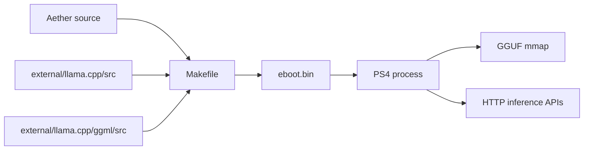

# llama.cpp Integration

Aether statically compiles llama.cpp and GGML into the PS4 homebrew. The app uses llama.cpp as a C API runtime and keeps PS4-specific behavior in Aether modules or the GGML bridge hook.



## Build Inputs

The Makefile compiles:

- `source/*.cpp`
- `external/llama.cpp/src/*.cpp`
- `external/llama.cpp/src/models/*.cpp`
- `external/llama.cpp/ggml/src/*.c`
- `external/llama.cpp/ggml/src/*.cpp`
- `external/llama.cpp/ggml/src/ggml-cpu/*.c`
- `external/llama.cpp/ggml/src/ggml-cpu/*.cpp`
- `external/llama.cpp/ggml/src/ggml-cpu/arch/x86/*.c`
- `external/llama.cpp/ggml/src/ggml-cpu/arch/x86/*.cpp`

## PS4 Compiler Flags

The build targets `x86_64-pc-freebsd12-elf` and uses the OpenOrbis sysroot.

Jaguar CPU flags:

```make
-mtune=btver2 -mavx -mssse3 -msse4.1 -msse4.2 -mno-avx2 -mno-fma -mno-f16c
```

GGML flags:

```make
-DGGML_USE_CPU -DGGML_USE_LLAMAFILE=0
```

`include/ps4_libc_shim.h` fills small libc gaps needed by libc++ and llama.cpp.

## Runtime Model Loading

Model files live in:

```text
/user/data/llm_models/
```

`source/model.cpp` handles:

- listing `.gguf` files
- unloading the current model
- mmap-based model loading
- one llama context at a time
- default context size `2048`
- default batch size `128`
- six decode threads

The model load path sets:

```cpp
mp.n_gpu_layers = 0;
mp.use_mmap = true;
mp.use_mlock = false;
mp.use_direct_io = false;
```

GPU work is not handled through llama.cpp GPU layers. It is handled by the GGML bridge described in [GPU.md](GPU.md).

## Prompting

The server manually builds ChatML prompts for chat requests:

```text
<|im_start|>user
...
<|im_end|>
<|im_start|>assistant
```

This avoids llama.cpp chat template exceptions in the PS4 SELF runtime.

## HTTP Endpoints

The HTTP server in `source/http_server.cpp` exposes:

- OpenAI chat completions
- OpenAI text completions
- Anthropic-style messages
- model load and unload
- default config updates
- logs and runtime status

The Web UI is loaded from `web/index.html` at runtime and served by the same HTTP server.
