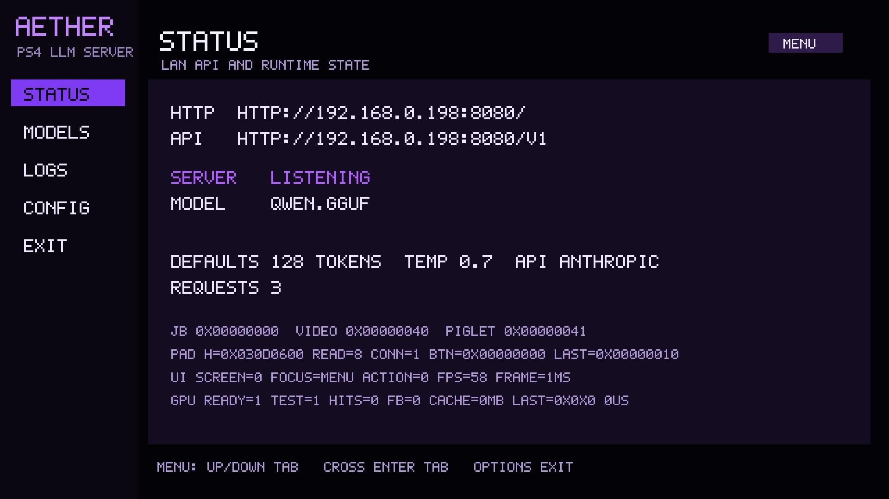
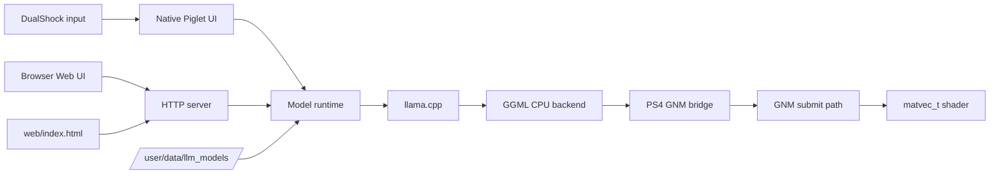
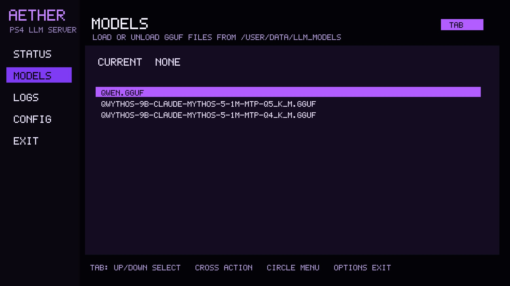
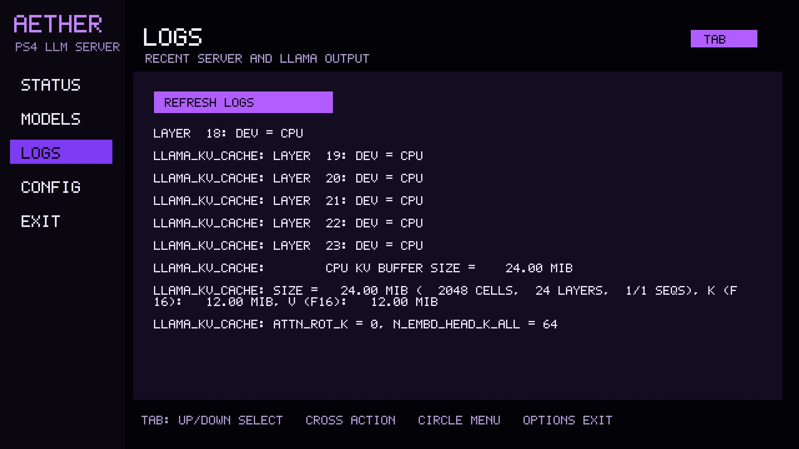
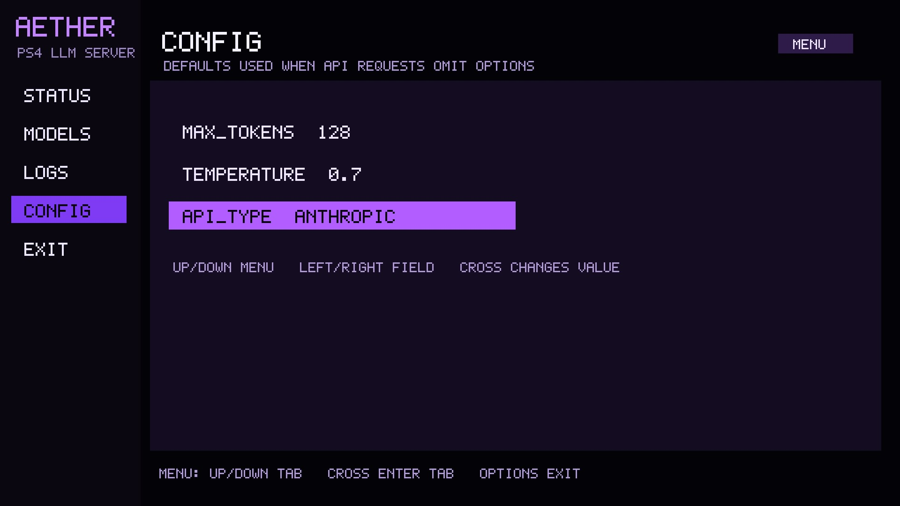
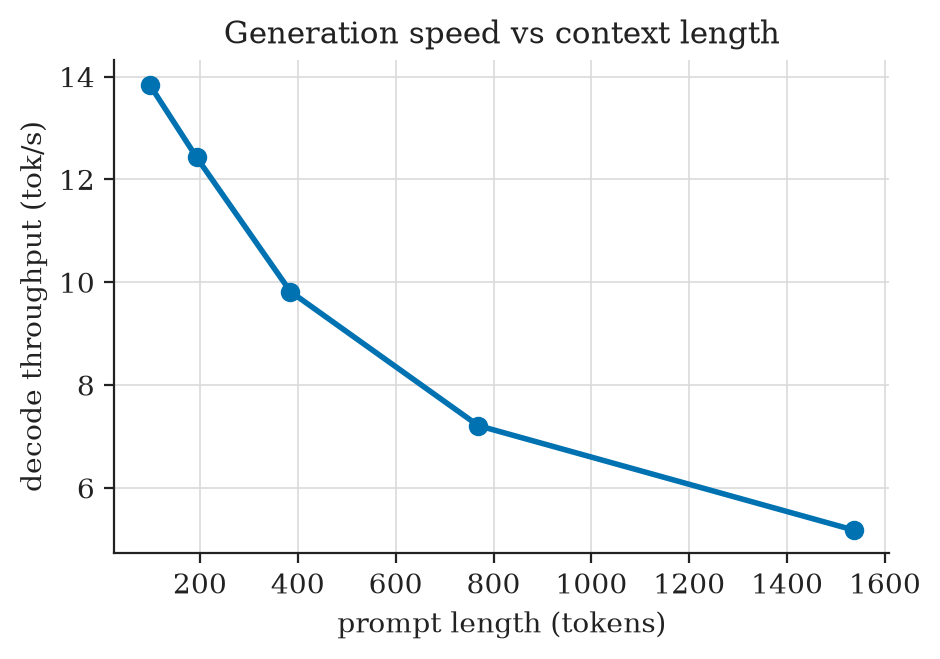
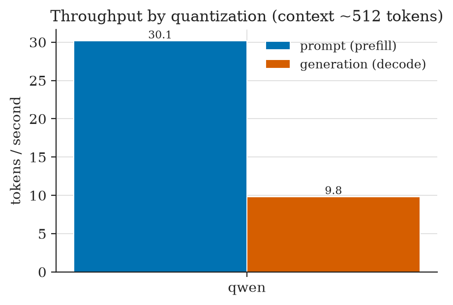
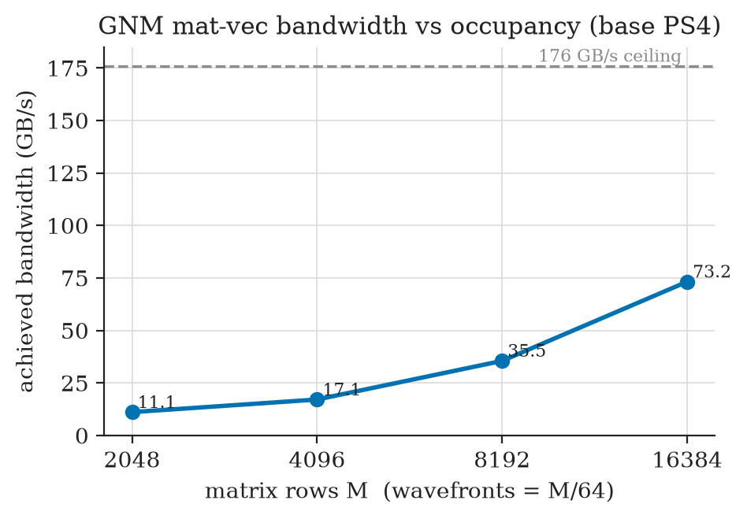
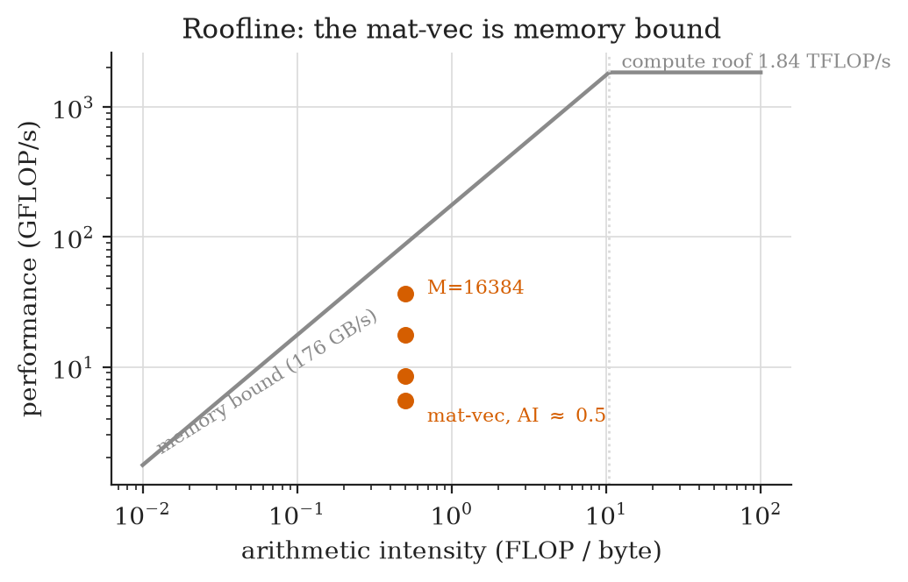

# Aether

Aether is a PS4 homebrew LLM server with a native PS4 UI, a browser UI, OpenAI-compatible HTTP endpoints, local GGUF model loading, and an experimental GNM bridge for selected GGML matrix-vector work.

The native status screen shows the app once the HTTP server, model runtime, controller input, and GPU bridge checks are visible from the console UI.

## Summary

- [Models](#models)
- [Architecture](#architecture)
- [Screenshots](#screenshots)
- [Evaluation Graphs](#evaluation-graphs)
- [Repository Layout](#repository-layout)
- [Docs](#docs)
- [Runtime APIs](#runtime-apis)

## Models

The runtime model directory is `/user/data/llm_models/`. Put `.gguf` files there, then load and unload them from the native UI or Web UI.

## Architecture

## Screenshots

The models view lists GGUF files from `/user/data/llm_models/` and keeps load/unload control available from the controller.

The logs view exposes recent llama.cpp and server output directly on the PS4, which is useful when the browser UI is unavailable.

The config view edits the same defaults used by API requests, including token limits, sampling temperature, and API response mode.

## Evaluation Graphs

Decode throughput drops as prompt length grows, so long contexts are the main pressure point for interactive use on the base console.

The Qwen run separates prompt prefill from decode speed, making the slower token generation path clear.

The GNM mat-vec test improves with larger matrix rows but remains below the theoretical memory bandwidth ceiling.

The roofline view frames the bridge as memory-bound work, which matches the mat-vec path targeted by the GGML offload experiment.

## Repository Layout

- `source/`: Aether app code split by runtime area.
- `include/aether/`: Aether headers.
- `web/index.html`: Web UI loaded from `/app0/web/index.html` at runtime.
- `external/llama.cpp/`: trimmed llama.cpp and GGML sources used by the PS4 build.
- `external/create-fself/`: SELF packaging helper.
- `sce_sys/`: PS4 package assets, including the launch background.
- `Media/jb.prx`: jailbreak helper loaded before UI and GPU setup.
- `shaders/`: source shaders for the GNM bridge.

## Docs

- [COMPILING.md](COMPILING.md) explains Docker and package builds.
- [GPU.md](GPU.md) explains the GGML to GNM bridge.
- [LLAMA.md](LLAMA.md) explains the llama.cpp integration.

## Runtime APIs

- `GET /status`
- `GET /logs`
- `GET /v1/models`
- `POST /load`
- `POST /unload`
- `POST /config`
- `POST /v1/chat/completions`
- `POST /v1/completions`
- `POST /v1/messages`
- `GET /gpu-test`
- `POST /gpu/offload`
