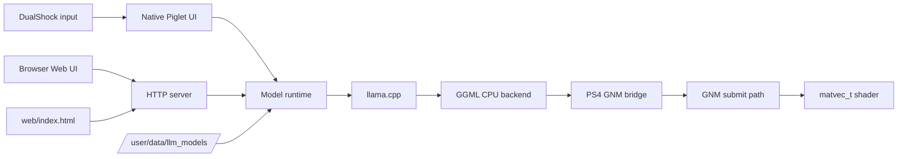

# Aether

Aether is a PS4 homebrew LLM server with a native PS4 UI, a browser UI, OpenAI-compatible HTTP endpoints, local GGUF model loading, and an experimental GNM bridge for selected GGML matrix-vector work.

The runtime model directory is `/user/data/llm_models/`. Put `.gguf` files there, then load and unload them from the native UI or Web UI.

## Screenshots

## Repository Layout

- `source/`: Aether app code split by runtime area.
- `include/aether/`: Aether headers.
- `web/index.html`: Web UI loaded from `/app0/web/index.html` at runtime.
- `external/llama.cpp/`: trimmed llama.cpp and GGML sources used by the PS4 build.
- `external/create-fself/`: SELF packaging helper.
- `sce_sys/`: PS4 package assets, including the launch background.
- `Media/jb.prx`: jailbreak helper loaded before UI and GPU setup.
- `shaders/`: source shaders for the GNM bridge.

## Docs

- [COMPILING.md](COMPILING.md) explains Docker and package builds.
- [GPU.md](GPU.md) explains the GGML to GNM bridge.
- [LLAMA.md](LLAMA.md) explains the llama.cpp integration.

## Runtime APIs

- `GET /status`
- `GET /logs`
- `GET /v1/models`
- `POST /load`
- `POST /unload`
- `POST /config`
- `POST /v1/chat/completions`
- `POST /v1/completions`
- `POST /v1/messages`
- `GET /gpu-test`
- `POST /gpu/offload`
